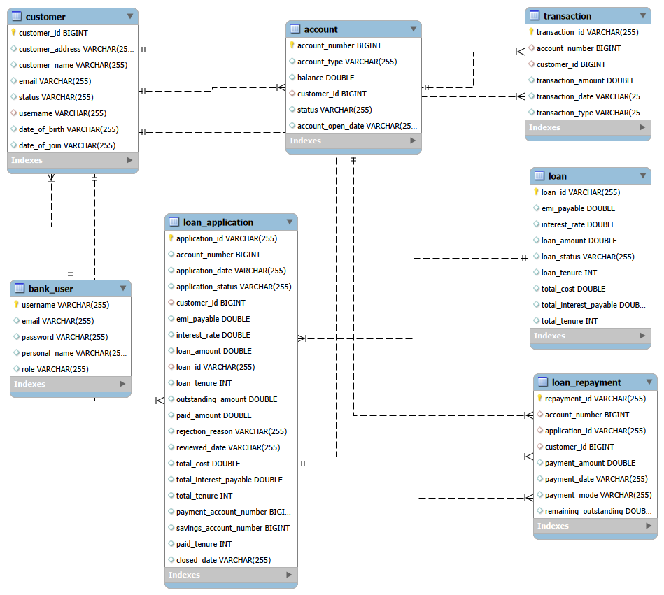

# FinCore Digital Banking Application

A comprehensive full-stack digital banking system built with **Spring Boot** and **React**, offering secure account management, transaction processing, loan management, and customer administration.


## 🎯 Project Overview

FinCore is a modern digital banking platform designed to provide secure and efficient financial services. The application supports multiple banking operations including account management, transaction tracking, loan processing, and administrative functions.

**Organization:** Infosys  
**Version:** 0.0.1-SNAPSHOT  
**Architecture:** Full-stack with microservices-ready design

---

## 🛠️ Technology Stack

### Backend
- **Framework:** Spring Boot 3.5.16
- **Java Version:** Java 17
- **Database:** MySQL
- **Security:** Spring Security
- **ORM:** Spring Data JPA
- **Build Tool:** Maven

### Frontend
- **Framework:** React 19.2.7
- **Routing:** React Router DOM 7.18.1
- **UI Library:** Bootstrap 5.3.8 & React Bootstrap 2.10.10
- **HTTP Client:** Axios 1.18.1
- **Package Manager:** npm
- **Port:** 3737

---

## 📁 Project Structure

```
fincore-digital-banking/
├── fincore-back/                          # Backend (Java/Spring Boot)
│   └── finCoreBankApplication/
│       ├── src/
│       │   ├── main/
│       │   │   ├── java/                  # Java source code
│       │   │   └── resources/             # Configuration files
│       │   └── test/
│       │       └── java/                  # Unit tests
│       ├── pom.xml                        # Maven configuration
│       ├── mvnw & mvnw.cmd               # Maven wrapper
│       └── target/                        # Build artifacts
│
└── fincore-front/                         # Frontend (React)
    ├── src/
    │   ├── Components/
    │   │   ├── AccountTransactionComponent/  # Account & transaction features
    │   │   ├── LoanComponent/               # Loan management
    │   │   ├── LoginComponent/              # Authentication
    │   │   └── common/                      # Reusable components
    │   ├── Services/                        # API service layers
    │   ├── styles/                          # Centralized styling
    │   ├── utils/                           # Helper functions
    │   ├── App.js                           # Root component
    │   └── index.js                         # Entry point
    ├── public/                              # Static assets
    ├── package.json                         # Dependencies
    └── README.md                            # Frontend documentation
```

---

## ✨ Features

### Account Management
- View account details and balance
- Manage multiple accounts
- Account entry and exit operations

### Transaction Processing
- Record and view transactions
- Generate transaction reports
- Admin transaction monitoring

### Loan Management
- Loan application and processing
- Loan tracking and status monitoring
- Loan history and documentation

### Customer Management
- Customer profile management
- Account linking
- Customer history tracking

### Authentication & Security
- Secure login/logout functionality
- Spring Security integration
- Protected routes and role-based access

### Admin Features
- Administrative dashboard
- Transaction reporting
- User and account management
- System monitoring

---

## 📋 Prerequisites

### Backend Requirements
- Java 17 or higher
- Maven 3.6 or higher
- MySQL 8.0 or higher
- Git

### Frontend Requirements
- Node.js 16.x or higher
- npm 8.x or higher
- Git

---

## 🚀 Installation & Setup

### Backend Setup

1. **Navigate to the backend directory:**
   ```bash
   cd fincore-digital-banking/fincore-back/finCoreBankApplication
   ```

2. **Configure the database:**
   - Create a MySQL database for FinCore
   - Update `src/main/resources/application.properties` with your database credentials:
     ```properties
     spring.datasource.url=jdbc:mysql://localhost:3306/fincore_db
     spring.datasource.username=your_username
     spring.datasource.password=your_password
     spring.jpa.hibernate.ddl-auto=update
     ```

3. **Build the backend:**
   ```bash
   mvn clean install
   ```

### Frontend Setup

1. **Navigate to the frontend directory:**
   ```bash
   cd fincore-digital-banking/fincore-front
   ```

2. **Install dependencies:**
   ```bash
   npm install
   ```

3. **Configure API endpoints (if needed):**
   - Update service files in `src/Services/` with your backend API base URL
   - Default configuration assumes backend runs on `http://localhost:9797`

---

## 🎮 Running the Application

### Start the Backend

```bash
cd fincore-digital-banking/fincore-back/finCoreBankApplication

# Using Maven
mvn spring-boot:run

# Or using the JAR file
java -jar target/finCoreBankApplication-0.0.1-SNAPSHOT.jar
```

The backend will start on **http://localhost:9797**

### Start the Frontend

```bash
cd fincore-digital-banking/fincore-front

# Start the development server
npm start
```

The frontend will automatically open at **http://localhost:3737**

### Run Tests

**Backend tests:**
```bash
cd fincore-digital-banking/fincore-back/finCoreBankApplication
mvn test
```

**Frontend tests:**
```bash
cd fincore-digital-banking/fincore-front
npm test
```

---

## 🔧 Project Components

### Frontend Components

#### Account & Transaction Features
- **AccountDetails** - Display account information
- **AccountEntry/Exit** - Account operations
- **AccountList** - List of user accounts
- **TransactionEntry** - Record new transactions
- **TransactionReport** - View transaction history
- **AdminTransactionReport** - Administrative reporting

#### Common Components
- **ActionButtons** - Reusable action button group
- **AppAlert** - Alert notifications
- **AppButton/AppInput/AppSelect** - Form elements
- **DataTable** - Tabular data display
- **Modal** - Dialog windows
- **ProtectedRoute** - Route protection wrapper
- **SearchBar** - Search functionality
- **StatusBadge** - Status indicators

#### Services Layer
- **AccountService** - Account operations API calls
- **CustomerService** - Customer data management
- **LoanService** - Loan processing
- **LoginService** - Authentication
- **TransactionService** - Transaction handling

### Styling System
Centralized style management with files for:
- Account styling
- Button styling
- Customer styling
- Dashboard styling
- Form styling
- Table styling
- Loan styling
- And more...

### Utilities
- **dateUtils** - Date formatting and manipulation
- **formatter** - Data formatting functions
- **validators** - Form validation rules
- **storage** - Local storage management
- **constants** - Application constants
- **helper** - General utility functions

---

## 🔗 API Integration

The frontend communicates with the backend through RESTful APIs using Axios. Services are organized by feature:

```javascript
// Example: Account Service
import axios from 'axios';

const API_BASE_URL = process.env.REACT_APP_API_URL || 'http://localhost:9797/api';

export const getAccounts = () => axios.get(`${API_BASE_URL}/accounts`);
export const getAccountDetails = (accountId) => axios.get(`${API_BASE_URL}/accounts/${accountId}`);
```

---

## �️ Database Schema

The application uses a relational database with the following core entities:



**Key Tables:**
- **customer** - Customer information and profiles
- **bank_user** - Bank user accounts and credentials
- **account** - Customer bank accounts
- **transaction** - Transaction records
- **loan_application** - Loan application requests
- **loan** - Approved loan records
- **loan_repayment** - Loan repayment tracking

---

## �📝 Development Guidelines

### Backend
- Follow Spring Boot conventions
- Use Spring Security for authentication
- Implement proper exception handling
- Write unit tests for all services
- Use JPA repositories for database operations

### Frontend
- Use functional components with React Hooks
- Follow component-based architecture
- Centralize styling using the style system
- Implement proper error handling
- Use protected routes for authenticated pages

---

## 🤝 Contributing

1. Create a feature branch: `git checkout -b feature/your-feature-name`
2. Commit your changes: `git commit -m 'Add your feature'`
3. Push to the branch: `git push origin feature/your-feature-name`
4. Submit a pull request

---

## 📞 Support

For questions or issues, please contact the development team or create an issue in the project repository.

**GitHub Repository:**  
[Secure-Digital-Banking-Platform-with-Transaction-Management-System](https://github.com/Magam-Nagarjuna/Secure-Digital-Banking-Platform-with-Transaction-Management-System)

---

## 📄 License

License This project is licensed under the MIT License: Copyright (c) 2026 Nagarjuna Magam Permission is hereby granted, free of charge, to any person obtaining a copy of this software and associated documentation files (the "Software"), to deal in the Software without restriction...

---

**Last Updated:** August 2026  
**Version:** 0.0.1-SNAPSHOT
